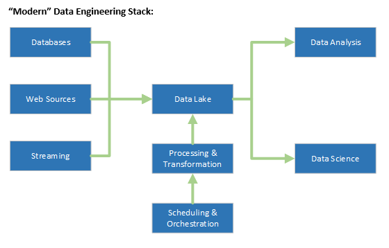

# Real-Time Data Architecture

Created: September 30, 2024 1:24 PM
Work: WI
Projects: WI Data Engineering (https://www.notion.so/WI-Data-Engineering-111bd64ff89680f28e62f570cf4b0e07?pvs=21)
Related Notes: Real-Time Data Processing (https://www.notion.so/Real-Time-Data-Processing-111bd64ff896804ba488d4ecea6644b9?pvs=21), OLAP Comparisons (https://www.notion.so/OLAP-Comparisons-111bd64ff896802c8c94d26f7eeca2aa?pvs=21)
Tasks: Investigate StarRocks (https://www.notion.so/Investigate-StarRocks-111bd64ff8968096860bf625a3cf487c?pvs=21), Investigate OLAP applications for WI (https://www.notion.so/Investigate-OLAP-applications-for-WI-111bd64ff89680dd833af627cf750e81?pvs=21), Investigate Apache Druid (https://www.notion.so/Investigate-Apache-Druid-111bd64ff8968049ba0deb6be01923aa?pvs=21)

## Modern Data Engineering Stack

| Block | Example Technologies |
| --- | --- |
| Databases | MSSQL, HANA DB, Postgres |
| Web Sources | WI Search |
| Streaming | MQTT, Kafka |
| Datalake | Elastic, MongoDB, RavenDB |
| Processing and Transformation | Node-RED, Pandas |
| Scheduling and Orchestration | Prefect, The Non-Sucking Service Manager |

| Component | Example Technologies |
| --- | --- |
| Low-Latency Data Processing | Apache Flink, Apache Storm |
| Scalable Storage Solutions | Redis, Apache Ignite |
| Data Analysis/Data Science (OLAP) | [Apache Druid](https://www.notion.so/OLAP-Comparisons-111bd64ff896802c8c94d26f7eeca2aa?pvs=21), [Clickhouse](https://www.notion.so/OLAP-Comparisons-111bd64ff896802c8c94d26f7eeca2aa?pvs=21), [StarRocks](https://www.notion.so/OLAP-Comparisons-111bd64ff896802c8c94d26f7eeca2aa?pvs=21) |